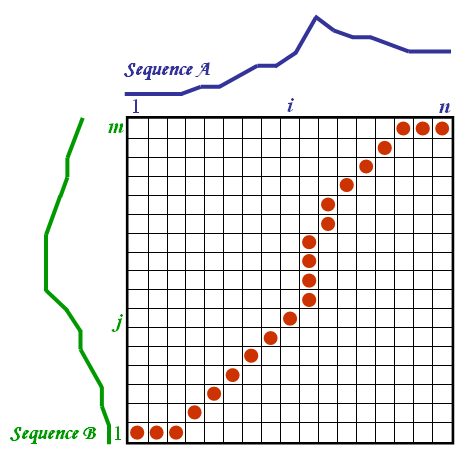

# Introducing Dynamic Time Warping Distance into Matrix Profile

*An academic project for COMP5331 Knowledge Discovery in Database (Fall 2017), a PhD-level computer science course at HKUST. Ranked # 1 among 20 groups.*

[Matrix Profile](https://www.cs.ucr.edu/%7Eeamonn/MatrixProfile.html) (MP) is a new concept that has the potential to revolutionize time series data mining. Traditionally, it uses the Euclidean distance to measure how similar two time series are. To enhance the robustness of similarity search, I introduced the [Dynamic Time Warping](https://en.wikipedia.org/wiki/Dynamic_time_warping) (DTW) distance into it. In doing so, I designed algorithms that greatly brought down the computational time complexity.


*DTW has a keen nose for similarities, even if curves have been stretched or squeezed. Source: XantaCross, Creative Commons.*

## Contents

- [Originalities](#originalities)
- [What's in The Repo](#whats-in-the-repo)
- [How To Compile](#how-to-compile)
- [How To Use](#how-to-use)
- [A Real Example](#a-real-example)
- [Specifications](#specifications)

## Originalities

The main challenge for introducing DTW into MP is --- the time complexity for computing either MP or DTW is heavy in itself, making the combination of the two very expensive.



*Calculating DTW involves dynamic programming. Source: Elena Tsiporkova, Dynamic Time Warping Algorithm.*

My originalities are

1. adapting lower bound functions to make them incrementally computable and using them to skip unnecessary calculations
2. applying randomized local search within each column of the matrix to quickly arrive at the minima

## What's in the Repo

#### report `/rpt`

`abstract.pdf`  abstract of report

`results.pdf`  empirical results

#### source code `/src`

`md.hpp, md.cpp`   Matrix Profile with dynamic time warping distance

`lb.hpp, lb.cpp`  lower-bound functions

`dtw.hpp, dtw.cpp`  dynamic time warping functions

`mat.hpp `  template matrix functions

`pnt.hpp, pnt.cpp`  print functions 

#### dataset `/dat`

`eeg3600`  EEG (electroencephalogram) recordings. 3,600 data points. 

`eeg400`  EEG (electroencephalogram) recordings. 400 data points. 

`forex1000`  daily USD/GBP exchange rates.

`light1189`  10-day mean light intensity recordings from S Carinae star.

`ox866`  oxygen-18 to oxygen-16 ratio in about 2.5 million years.

`sea1400`  Darwin Sea level pressures (monthly), from 1882 to 1998.

`soi540`  the Southern Oscillation Index, related to climate change.

*All data are obtained from the Department of Statistical Science of Duke University.*

## How to Compile

Download source code. Compile with a C++11 compliant compiler, *e.g.*

```powershell
cd src
g++ md.cpp lb.cpp dtw.cpp pnt.cpp -o ../a.exe -std=c++11
cd ..
```

## How to Use

#### *command-line options*

 `exec [data] [length n] [band width r] [subsequence length m / subsequence proportion mm]`

#### *command-line example*

*For example,* say the executable's name is `a.exe`, then run on Windows command prompt

`a dat/sea1400 1000 2 200 `

would compute on the first `n = 1,000` data points of data `sea1400` with Sakoe-Chiba band width `r = 2`, and subsequence length `m = 200` (or subsequent proportion `mm = 0.2`).

## A Real Example

With executable's name `a.exe`,  run on Windows Command Prompt

`a dat/light1189 1000 1 0.05`

will yield

```
...
DTW Brutal Force : Time = 6.2 s 
...
DTW Lower Bound : Time = 0.4 s 
# Saved = 857231 (97%) 
... 
```

While it takes 6.2 seconds to compute the Matrix Profile by brutal force, it takes only 0.4 second to do so using the algorithm with incrementally computed lower-bound functions. 97% of the entries are skipped in calculation.

## Specifications

#### variable names

`t`  time series

`n`  length of entire time series data 

`m`  query length of subsequence 

`l`  length of Matrix Profile, which is `n – m + 1` 

`f`  length of forbidden zone, where there is no need to compute 

`g`  number of entries to compute (all entries in matrix except for the ones in the forbidden zone) 

`r`  Sakoe-Chiba band width

`e`  random engine 

#### requirements

- time series data length `100 < n < 10000` 

- Sakoe-Chiba band width `r in [0, m/2]`

- subsequence length `m in [1, n/2]` or subsequence proportion `mm in (0, 0.5]`


#### default values

- time series data length `n = 1000 `
- Sakoe-Chiba band width `r = 1` 
- subsequence length `m = n/10`, or subsequence proportion `mm = 0.1` 
- if no data file is provided, the program will generate a random time series. 

[Back to Top](#introducing-dynamic-time-warping-distance-into-matrix-profile)
