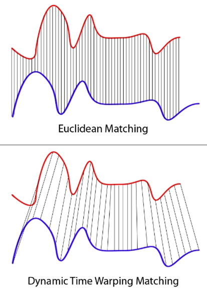
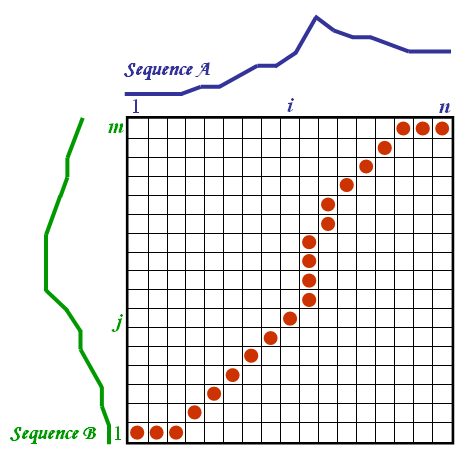

# Introducing Dynamic Time Warping Distance into Matrix Profile

*A demo of code. Note how fast the optimized algorithms are, compared with brutal force. Over 95% of the entries are skipped.*

*This repository stores the C++ code for an academic project on time series data mining.* 

- For the instructions on how to compile and use the code for this project, click [here](#instructions).

- For an abstract and emprical results of this project, click [here](#summary).

- For more information about this project, click [here](#more-information).

---

Matrix Profile (MP) has emerged as a new concept in the data mining community since 2016. It is a framework to extract information from time series, which later can be applied in similarity research. Two steps are involved:

1. construct a matrix profile
2. use the matrix profile

In Step 1, the current setting uses the traditional Euclidean distance to measure how similar two subsequences are. However, a better approach would be using the Dynamic Time Warping (DTW) distance. See the graph below for intuition.

*DTW is sharp in detecting similarity even if a curve has been stretched or squeezed.*

As an initial attempt in the academic community, I introduced DTW into MP.

The main challenge is --- the time complexity for computing both MP and DTW are heavy themselves, making the combination of the two intimidatingly expensive.

*Calculating DTW involves dynamic programming.*

My originalities are

1. adapting lower bound functions and using them to skip many unnecessary computations
2. applying randomized local search within each column of the matrix

### Instructions

The instructions on how to compile and use my code, and a full description of every source file and the dataset are [here](README.pdf) (PDF).

### Summary

An abstract of this project is [here](summary/abstract.pdf) (PDF).

The empirical results are [here](summary/results.pdf) (PDF).

### More Information

This project is an academic project that I did together with Lee Yik-Yeung, for [*COMP5331: Knowledge Discovery in Databases*](https://www.cse.ust.hk/~raywong/comp5331/), a PhD-level course that I took at the CS Dept. at HKUST in Fall 2017.

This project was supervised by [Prof. Raymond Wong](https://www.cse.ust.hk/~raywong/), one of the best teachers that I has ever met in my life. I would like to take this opportunity to again express my gratitude.

I am responsible for the algorithms and the code.

For more of my projects, please visit [my website](https://aafulei.github.io) (GitHub Pages).

[Back to Top](#introducing-dynamic-time-warping-distance-into-matrix-profile)
